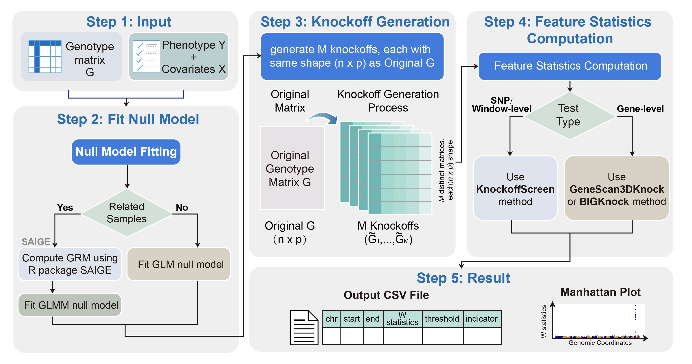

# KnockoffPipeline

## Overview

KnockoffPipeline is a unified R framework for genome-wide association analysis with rigorous false discovery rate (FDR) control via knockoff-based methods.

The pipeline supports:

- SNP-level and sliding-window inference (**Single_Window**)
- Gene-centric inference with 3D enhancer information (**Gene_Centric**)
- Unrelated and related sample analysis
- Multiple phenotypes in a single run (shared knockoffs across phenotypes)
- **Knockoff persistence**: save generated knockoffs and reload them across sessions
- **Two-stage workflow**: decouple knockoff generation from association testing

## Workflow



---

## Supported Methods

| Method              | Input              | Sample type  | Description                                          |
|---------------------|--------------------|--------------|------------------------------------------------------|
| **KnockoffScreen**  | SNP genotypes      | Unrelated    | SNP-level and sliding-window inference               |
| **GeneScan3DKnock** | SNP genotypes      | Unrelated    | Gene-centric inference via 3D enhancer mapping       |
| **BIGKnock**        | SNP genotypes + GRM | Related     | Gene-centric inference with GLMM null model          |

---

## Installation

### conda

First, clone the repository and enter it.

```bash
git clone https://github.com/tianyingw/knockoff-pipeline.git
cd knockoff-pipeline
```

#### 1. Create a conda environment

```bash
conda env create -f inst/conda_env/environment.yml
conda activate pipeline
FLAGPATH=`which python | sed 's|/bin/python$||'`
export LDFLAGS="-L${FLAGPATH}/lib"
export CPPFLAGS="-I${FLAGPATH}/include"
```

#### 2. Install R dependencies

```bash
Rscript inst/conda_env/install_packages.R
```

#### 3. Install SAIGE

```bash
R CMD INSTALL SAIGE_new
```

#### 4. Install KnockoffPipeline in R

```R
devtools::install_github("tianyingw/knockoff-pipeline")
```

---

## Runnable Examples (Quick Start)

The runnable demo data and scripts are provided under `inst/examples/`.

| Script             | Description                                      |
|--------------------|--------------------------------------------------|
| `SNP_Window.R`     | SNP/window-level analysis, unrelated samples     |
| `Gene_unrelated.R` | Gene-centric analysis, unrelated samples         |
| `Gene_related.R`   | Gene-centric analysis, related samples (BIGKnock) |

Run an example from the package root:

```bash
Rscript inst/examples/SNP_Window.R
```

By default, the example scripts read demo input from `inst/examples/input/` and write output to `inst/examples/output/`. You can override the output directory, PLINK executable, and CPU cores with environment variables:

```bash
KNOCKOFF_OUTDIR=results/demo PLINK_BIN=plink2 KNOCKOFF_CORES=2 Rscript inst/examples/SNP_Window.R
```

---

## Input Structure Examples

Code blocks in the sections below are intended only to illustrate input structure and common argument combinations. They are not complete runnable examples. Use the scripts in the Quick Start section for runnable demo data and commands.

```R
library(KnockoffPipeline)

run_pipeline(
  outdir     = "results/",
  test_type  = "Single_Window",   # or "Gene_Centric"
  pheno_file = "data/pheno.csv",
  geno_file  = "data/geno",       # PLINK prefix
  phenotype  = "BMI"
)
```

---

## Input Requirements

### Required

| Argument     | Description                                              |
|--------------|----------------------------------------------------------|
| `outdir`     | Output directory (created automatically if absent)       |
| `test_type`  | `"Single_Window"` or `"Gene_Centric"`                   |
| `geno_file`  | PLINK genotype file prefix (`.bed/.bim/.fam`)            |

### Optional

| Argument                  | Description                                                                                      | Default               |
|---------------------------|--------------------------------------------------------------------------------------------------|-----------------------|
| `pheno_file`              | Phenotype file (CSV/TSV). Optional for `pipeline_stage = "stage1_knockoff"`; required otherwise | `NULL`                |
| `phenotype`               | Column name(s) of phenotype(s). Optional for `pipeline_stage = "stage1_knockoff"`               | `NULL`                |
| `pheno_id`                | Column name of sample ID in phenotype file                                                       | `NULL`                |
| `covar_cols`              | Continuous covariate column names                                                                | `NULL`                |
| `cat_covar_cols`          | Categorical covariate column names                                                               | `NULL`                |
| `sliding_window_length`   | Window sizes (bp) for `Single_Window` mode                                                       | `c(1000, 5000, 10000)` |
| `M`                       | Number of knockoff copies                                                                        | `5`                   |
| `geno_missing_imputation` | Genotype imputation method (`"fixed"` or `"mean"`)                                               | `"fixed"`             |
| `plink_path`              | Path to PLINK executable                                                                         | `"plink2"`            |
| `genome_build`            | `"hg19"` or `"hg38"`                                                                             | `"hg19"`              |
| `sample_uncorrelated`     | `TRUE` = GLM null model; `FALSE` = GLMM via SAIGE                                               | `TRUE`                |
| `grm_file`                | Sparse GRM file (required only for `sample_uncorrelated = FALSE`)                                | `NULL`                |
| `grm_id_file`             | Sparse GRM ID file                                                                               | `NULL`                |
| `fdr`                     | Target FDR level                                                                                 | `0.1`                 |
| `chromosomes`             | Autosomes to analyse                                                                             | `1:22`                |
| `user_cores`              | Number of CPU threads                                                                            | `1`                   |
| `batch_size`              | Genes per batch (Gene_Centric only)                                                              | `20`                  |
| `read_mid_exist`          | Skip chromosomes with existing intermediate files                                                | `TRUE`                |
| **`pipeline_stage`**      | `"full"`, `"stage1_knockoff"`, or `"stage2_analysis"` — see below                              | `"full"`              |
| **`save_knockoff`**       | Whether to retain the knockoff directory after the run completes                                 | `NULL`                |
| **`knockoff_dir`**        | Directory for knockoff `.rds` files (defaults to `<outdir>/knockoffs`)                           | `NULL`                |

---

## Key Features

The `run_pipeline()` snippets in this section are schematic usage patterns, not standalone runnable scripts. They use placeholder paths and may omit required context; use the Quick Start scripts above for commands that run directly on the bundled demo data.

### Multiple Phenotypes

Pass a character vector to `phenotype`. The pipeline:

1. Removes samples missing in **any** phenotype or covariate once, producing a single consistent sample set.
2. Generates knockoffs on the first phenotype pass and **always persists them internally** so all subsequent phenotypes can reuse them.
3. Writes per-phenotype results to `<outdir>/<phenotype_name>/`.

```R
run_pipeline(
  outdir    = "results/",
  test_type = "Gene_Centric",
  pheno_file = "data/pheno.csv",
  geno_file  = "data/geno",
  phenotype  = c("BMI", "LDL", "SBP"),   # three phenotypes
  pheno_id   = "IID"
)
```

### Knockoff Persistence (`save_knockoff`)

`save_knockoff` now controls whether the knockoff directory is **retained after the run completes**.

- `save_knockoff = TRUE`: keep `knockoff_dir` on disk after the run
- `save_knockoff = FALSE`: allow temporary on-disk knockoff files during the run, but remove them at the end
- `save_knockoff = NULL`: resolve automatically to `TRUE` for `pipeline_stage = "stage1_knockoff"` and `FALSE` otherwise

In multi-phenotype runs, knockoffs are always written to disk internally so later phenotypes can reuse them. If `save_knockoff = FALSE`, that directory is deleted after the final phenotype finishes.

```R
# Keep knockoffs after the run
run_pipeline(..., save_knockoff = TRUE)

# Later run: reuse previously saved knockoffs
run_pipeline(..., pipeline_stage = "stage2_analysis", knockoff_dir = "results/knockoffs")
```

Each knockoff file stores the sample ID list and SNP positions. On load, the pipeline checks that:
- The **column count** (number of SNPs after QC) matches. If not, a warning is issued and knockoffs are regenerated.
- The **sample order** is aligned to the current analysis. Missing samples trigger a warning; extra saved samples are silently ignored.

### Two-Stage Workflow (`pipeline_stage`)

The pipeline can be split into two independent stages, useful when knockoff generation and association testing need to run in separate jobs (e.g., on a cluster), or when the same knockoffs will be reused with multiple phenotype files that are not yet available.

| `pipeline_stage`       | What it does                                                                 |
|------------------------|------------------------------------------------------------------------------|
| `"full"` (default)     | Complete end-to-end pipeline                                                 |
| `"stage1_knockoff"`    | Generate knockoffs only; write sample list; no association testing           |
| `"stage2_analysis"`    | Load saved knockoffs; fit null models; run association tests                 |

**Stage 1:**

```R
run_pipeline(
  outdir         = "results/",
  test_type      = "Gene_Centric",
  geno_file      = "data/geno",
  pipeline_stage = "stage1_knockoff",
  knockoff_dir   = "results/knockoffs"
)
# Outputs:
#   results/knockoffs/chr1/gene_BRCA1_ko.rds  ...
#   results/knockoffs/knockoff_sample_list.txt
```

**Stage 2** (can use a completely different phenotype file):

```R
run_pipeline(
  outdir         = "results_AD/",
  test_type      = "Gene_Centric",
  pheno_file     = "data/pheno_AD.csv",
  geno_file      = "data/geno",
  phenotype      = "AD",
  pipeline_stage = "stage2_analysis",
  knockoff_dir   = "results/knockoffs"   # same knockoffs from stage 1
)
```

Stage 2 reads `knockoff_sample_list.txt`, computes the intersection with the current genotype/phenotype data, reindexes knockoff rows accordingly, and warns if any samples are lost in either direction.

---

### Checkpoint Recovery

The pipeline supports automatic restart from intermediate results. Set:

```R
read_mid_exist = TRUE   # (default)
```

The pipeline will detect existing per-chromosome intermediate files and skip completed chromosomes.

---

## Output Files

Use `<analysis_outdir>` below for the directory that receives one analysis result set. For a single phenotype, `<analysis_outdir>` is `<outdir>`. For multiple phenotypes, each phenotype gets its own `<analysis_outdir>` at `<outdir>/<phenotype_name>`. Intermediate files are written under `<analysis_outdir>/mid/`.

### Single_Window

| File                                  | Description                      |
|---------------------------------------|----------------------------------|
| `<analysis_outdir>/Single_Window_results.csv`  | Full results table               |
| `<analysis_outdir>/manhattan_plot_single.png`  | Manhattan / Q–Q plot             |
| `<analysis_outdir>/mid/Single_mid_results_chr*.txt` | Per-chromosome intermediate SNP  |
| `<analysis_outdir>/mid/Window_mid_results_chr*.txt` | Per-chromosome intermediate window |

### Gene_Centric

| File                                  | Description                      |
|---------------------------------------|----------------------------------|
| `<analysis_outdir>/GeneCentric_results.csv`    | Full results table               |
| `<analysis_outdir>/manhattan_plot_gene.png`    | Manhattan / Q–Q plot             |
| `<analysis_outdir>/mid/GeneCentric_mid_results_chr*.txt` | Per-chromosome intermediate      |

### Knockoffs (when retained, or during internal multi-phenotype reuse)

| File                                           | Description                                 |
|------------------------------------------------|---------------------------------------------|
| `<knockoff_dir>/knockoff_sample_list.txt`      | Sample IID list in knockoff row order       |
| `<knockoff_dir>/chr<c>/block_XXXX_knockoff.rds` | Per-LD-block knockoff (Single_Window)       |
| `<knockoff_dir>/chr<c>/gene_<ID>_ko.rds`       | Per-gene knockoff, gene buffer only (Gene_Centric) |

### Multi-phenotype runs

Results for each phenotype are written to `<outdir>/<phenotype_name>/`.

