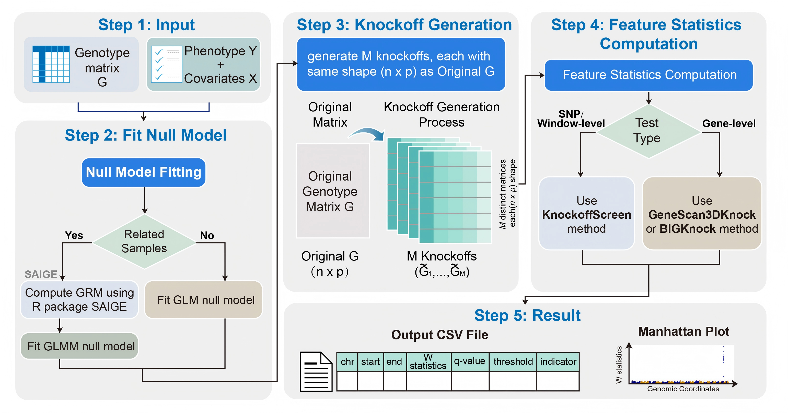

# KnockoffPipeline

## Overview

KnockoffPipeline is a unified R framework for genome-wide association analysis with knockoff-based false discovery rate (FDR) control under the assumptions of its supported upstream methods.

The pipeline supports:

- SNP-level and sliding-window inference (**Single_Window**)
- Gene-centric inference with 3D enhancer information (**Gene_Centric**)
- Standard-GLM and relatedness-aware GLMM analysis paths
- Multiple phenotypes in a single run (reuse of SNP/window or gene-buffer knockoffs; gene-centric enhancer knockoffs are regenerated)
- **Knockoff persistence**: save generated knockoffs and reload them across sessions
- **Two-stage workflow**: decouple knockoff generation from association testing

## Workflow



---

## Supported Methods

| Method              | Input               | Model path    | Description                                                     |
|---------------------|---------------------|---------------|-----------------------------------------------------------------|
| **KnockoffScreen**  | SNP genotypes       | Standard GLM  | SNP/window inference; relatedness is not explicitly modeled     |
| **GeneScan3DKnock** | SNP genotypes       | Standard GLM  | Gene-centric inference; relatedness is not explicitly modeled   |
| **BIGKnock**        | SNP genotypes + GRM | SAIGE GLMM    | Gene-centric inference with relatedness adjustment               |

---

## Installation

### conda

First, clone the repository and enter it.

```bash
git clone https://github.com/tianyingw/knockoff-pipeline.git
cd knockoff-pipeline
```

#### 1. Create a conda environment

```bash
conda env create -f inst/conda_env/environment.yml
conda activate pipeline
FLAGPATH=`which python | sed 's|/bin/python$||'`
export LDFLAGS="-L${FLAGPATH}/lib"
export CPPFLAGS="-I${FLAGPATH}/include"
```

#### 2. Install R dependencies

```bash
Rscript inst/conda_env/install_packages.R
```

#### 3. Install SAIGE

```bash
R CMD INSTALL SAIGE_new
```

#### 4. Install KnockoffPipeline in R

```R
devtools::install_github("tianyingw/knockoff-pipeline")
```

---

## Runnable Example (Quick Start)

The installed package contains a small standard-GLM demo. Resolve the
actual `demo.bed` path with `system.file()` and then remove only its `.bed`
extension to obtain the PLINK prefix. This works from any working directory;
`system.file("examples/input/demo")` does not, because that extensionless file
does not exist.

```R
library(KnockoffPipeline)

demo_bed <- system.file(
  "examples", "input", "demo.bed",
  package = "KnockoffPipeline", mustWork = TRUE
)
demo_geno <- tools::file_path_sans_ext(demo_bed)
demo_pheno <- system.file(
  "examples", "input", "phenotype.csv",
  package = "KnockoffPipeline", mustWork = TRUE
)

# A fresh directory prevents committed/example output from being mistaken for
# a resumable checkpoint. Supply your own new directory to retain the results.
demo_outdir <- tempfile("KnockoffPipeline-SNP-Window-")

run_pipeline(
  outdir = demo_outdir,
  test_type = "Single_Window",
  geno_file = demo_geno,
  pheno_file = demo_pheno,
  phenotype = "Y",
  pheno_id = "IID",
  covar_cols = "X1",
  chromosomes = 1,
  seed = 20260915L,
  read_mid_exist = FALSE
)
```

The source checkout also contains `inst/examples/SNP_Window.R` and
`inst/examples/Gene_unrelated.R`. Those scripts use repository-relative paths;
when running them, optionally set `KNOCKOFF_OUTDIR`; otherwise each script uses
a fresh temporary output directory.

---

## Input Structure Examples

Code blocks in the sections below are intended only to illustrate input structure and common argument combinations. They are not complete runnable examples. Use the installed-package Quick Start above for runnable demo data and commands.

```R
library(KnockoffPipeline)

run_pipeline(
  outdir     = "results/",
  test_type  = "Single_Window",   # or "Gene_Centric"
  pheno_file = "data/pheno.csv",
  geno_file  = "data/geno",       # PLINK prefix
  phenotype  = "BMI"
)
```

---

## Input Requirements

### Required

| Argument     | Description                                              |
|--------------|----------------------------------------------------------|
| `outdir`     | Output directory (created automatically if absent)       |
| `test_type`  | `"Single_Window"` or `"Gene_Centric"`                   |
| `geno_file`  | PLINK genotype file prefix (`.bed/.bim/.fam`)            |
| `pheno_file` | Phenotype file (CSV/TSV), required for every stage        |
| `phenotype`  | Phenotype column name(s), required for every stage        |

### Optional

| Argument                  | Description                                                                                      | Default               |
|---------------------------|--------------------------------------------------------------------------------------------------|-----------------------|
| `pheno_id`                | Column name of sample ID in phenotype file                                                       | `NULL`                |
| `covar_cols`              | Continuous covariate column names                                                                | `NULL`                |
| `cat_covar_cols`          | Categorical covariate column names                                                               | `NULL`                |
| `sliding_window_length`   | Window sizes (bp) for `Single_Window` mode                                                       | `c(1000, 5000, 10000)` |
| `M`                       | Number of knockoff copies                                                                        | `5`                   |
| `seed`                    | Optional base seed; deterministic unit-specific seeds are derived for each block or gene; required for random imputation and recommended for reproducible restart, stage-1/stage-2, or multi-phenotype runs | `NULL` |
| `geno_missing_imputation` | Genotype imputation method for `Single_Window` (`"fixed"`, `"random"`, or `"bestguess"`); `Gene_Centric` currently uses fixed imputation | `"fixed"` |
| `plink_path`              | Path to a PLINK 1.9 or PLINK 2 executable; the package selects `--recode A` or `--export A` from its version | `"plink2"`            |
| `genome_build`            | `"hg19"` or `"hg38"`                                                                             | `"hg19"`              |
| `ld_block_file`           | Ancestry-matched LD blocks with `chr`, `start`, and `stop` columns (`Single_Window` only); `NULL` uses the bundled European-ancestry resource for the selected build | `NULL` |
| `sample_uncorrelated`     | Model-path selector: `TRUE` = standard GLM (does not test or prune relatedness); `FALSE` = BIGKnock/SAIGE GLMM for `Gene_Centric`; `Single_Window` currently accepts `TRUE` only | `TRUE` |
| `grm_file`                | Optional existing sparse GRM for `sample_uncorrelated = FALSE`; `NULL` constructs one            | `NULL`                |
| `grm_id_file`             | Sample-ID file paired with a supplied sparse GRM                                                 | `NULL`                |
| `relatedness_cutoff`      | Relatedness cutoff used when SAIGE constructs a sparse GRM                                      | `0.125`               |
| `n_markers_grm`           | Number of randomly selected markers used when SAIGE constructs a sparse GRM                     | `1000`                |
| `fdr`                     | Target FDR level                                                                                 | `0.1`                 |
| `chromosomes`             | Autosomes to analyse                                                                             | `1:22`                |
| `user_cores`              | Number of CPU threads                                                                            | `1`                   |
| `batch_size`              | Genes per batch (Gene_Centric only)                                                              | `20`                  |
| `read_mid_exist`          | Skip chromosomes with existing intermediate files                                                | `TRUE`                |
| **`pipeline_stage`**      | `"full"`, `"stage1_knockoff"`, or `"stage2_analysis"` — see below                              | `"full"`              |
| **`save_knockoff`**       | Whether to retain the knockoff directory after the run completes                                 | `NULL`                |
| **`knockoff_dir`**        | Directory for saved knockoff manifests and matrix files (defaults to `<outdir>/knockoffs`)       | `NULL`                |
| **`temp_dir`**            | Node-local directory for temporary PLINK exports; prefers `SLURM_TMPDIR` when unset              | `NULL`                |

---

## Key Features

The `run_pipeline()` snippets in this section are schematic usage patterns, not standalone runnable scripts. They use placeholder paths and may omit required context; use the Quick Start example above for code that runs directly on the bundled demo data.

### Multiple Phenotypes

Pass a character vector to `phenotype`. The pipeline:

1. Removes samples missing in **any** phenotype or covariate once, producing a single consistent sample set.
2. Generates knockoffs on the first phenotype pass and persists reusable objects internally. SNP/window knockoffs and gene-buffer knockoffs are reused; gene-centric enhancer knockoffs are regenerated for each phenotype.
3. Writes per-phenotype results to `<outdir>/<phenotype_name>/`.

```R
run_pipeline(
  outdir    = "results/",
  test_type = "Gene_Centric",
  pheno_file = "data/pheno.csv",
  geno_file  = "data/geno",
  phenotype  = c("BMI", "LDL", "SBP"),   # three phenotypes
  pheno_id   = "IID"
)
```

### Knockoff Persistence (`save_knockoff`)

`save_knockoff` now controls whether the knockoff directory is **retained after the run completes**.

- `save_knockoff = TRUE`: write knockoffs and keep `knockoff_dir` on disk after the run, including a single-phenotype `"full"` run
- `save_knockoff = FALSE`: a single-phenotype `"full"` run keeps knockoffs in memory; a multi-phenotype `"full"` run may use temporary on-disk files
- `save_knockoff = NULL`: resolve automatically to `TRUE` for `pipeline_stage = "stage1_knockoff"` and `FALSE` otherwise

In multi-phenotype `"full"` runs, knockoffs are always written to disk internally so later phenotypes can reuse them. If `save_knockoff = FALSE`, a knockoff directory created by that run is removed after the final phenotype finishes. A pre-existing directory is not recursively deleted; use a dedicated knockoff directory so its checkpoint files can be managed as one unit. `"stage2_analysis"` treats its supplied `knockoff_dir` as input and never deletes it.

```R
# Keep knockoffs after the run
run_pipeline(..., save_knockoff = TRUE)

# Later run: reuse previously saved knockoffs
run_pipeline(..., pipeline_stage = "stage2_analysis", knockoff_dir = "results/knockoffs")
```

Each saved knockoff unit records sample IDs, SNP positions, and a versioned
compatibility context alongside its matrix storage. Reuse is validated before
any saved matrix is accepted:

- Sample IDs are kept as strings, so alphabetic IDs and leading zeros are not
  lost. Saved rows may be reordered, but the saved and current sample-ID sets
  must match exactly. A mismatch errors rather than silently changing the
  analysis population. Stage 1 applies the same phenotype/covariate
  complete-case and PLINK-ID matching rules as downstream analysis.
- The ordered variant fingerprint contains chromosome, BIM variant ID, BIM base
  position, both alleles, and the coded allele. Equal column counts are not
  sufficient: a change in variant identity, order, position, or allele is an
  incompatibility.
- The analysis path, `M`, `genome_build`, and construction settings are checked
  exactly, together with the LD-block definition file for `Single_Window` or
  the gene-annotation file for `Gene_Centric`.

Missing/obsolete compatibility metadata or any variant, build, construction,
`M`, or reference mismatch fails closed with an error. The pipeline does not silently
reuse or regenerate an incompatible saved knockoff; start a new knockoff
directory or explicitly regenerate it.

For `Single_Window`, each `block_*_knockoff.rds` file is a serializable
manifest, not a self-contained matrix file. Its `storage`,
`descriptor_files`, sample IDs, and compatibility context point to one
file-backed `big.matrix` per knockoff copy. The corresponding `.desc` and
`.bin` files live beside the manifest. Copy, move, archive, or delete the
knockoff directory as a whole; separating the manifest from any backing file
makes it unusable. Stage 2 checks the manifest and required descriptor/backing
files and fails closed if the saved set is incomplete or incompatible.
`Gene_Centric` knockoff arrays remain stored inside their per-gene RDS files.

### Two-Stage Workflow (`pipeline_stage`)

The pipeline can be split into two jobs so reusable knockoff construction and downstream analysis can be scheduled separately (e.g., on a cluster). Stage 1 requires the phenotype and covariate specification so that it generates knockoffs for the exact downstream complete-case sample set. In gene-centric mode, Stage 1 saves gene-buffer knockoffs; enhancer knockoffs remain part of Stage 2.

| `pipeline_stage`       | What it does                                                                 |
|------------------------|------------------------------------------------------------------------------|
| `"full"` (default)     | Complete end-to-end pipeline                                                 |
| `"stage1_knockoff"`    | Form the complete-case sample set, generate reusable knockoffs, and write its sample list; no null-model fitting or association testing |
| `"stage2_analysis"`    | Load saved knockoffs, complete mode-specific computation (including gene-centric enhancer knockoffs), fit null models, and run association tests; never delete the supplied knockoff directory |

**Stage 1:**

```R
run_pipeline(
  outdir         = "results/",
  test_type      = "Gene_Centric",
  pheno_file     = "data/pheno_AD.csv",
  geno_file      = "data/geno",
  phenotype      = "AD",
  pheno_id       = "IID",
  covar_cols     = c("age", "PC1"),
  pipeline_stage = "stage1_knockoff",
  knockoff_dir   = "results/knockoffs",
  seed           = 20260915L
)
# Outputs:
#   results/knockoffs/chr1/gene_BRCA1_ko.rds  ...
#   results/knockoffs/knockoff_sample_list.txt
```

**Stage 2** (the resulting complete-case IID set must match Stage 1):

```R
run_pipeline(
  outdir         = "results_AD/",
  test_type      = "Gene_Centric",
  pheno_file     = "data/pheno_AD.csv",
  geno_file      = "data/geno",
  phenotype      = "AD",
  pheno_id       = "IID",
  covar_cols     = c("age", "PC1"),
  pipeline_stage = "stage2_analysis",
  knockoff_dir   = "results/knockoffs",  # same knockoffs from stage 1
  seed           = 20260915L
)
```

Stage 2 reads `knockoff_sample_list.txt`, requires the same character-ID set,
and reindexes rows if only their order differs. If a different phenotype or
covariate specification changes the complete-case set, run Stage 1 again in a
new knockoff directory.

---

### Checkpoint Recovery

The pipeline supports automatic restart from intermediate results. Set:

```R
read_mid_exist = TRUE   # (default)
```

Before any intermediate result is accepted, the pipeline compares
`<mid_dir>/checkpoint_context.rds` with the current phenotype, character-IID
sample order, PLINK input identity, reference resources, model path, seed, and
analysis settings. A mismatch or legacy intermediate directory without this
manifest fails closed instead of mixing runs.

**Single_Window**: After each LD block completes, its results are written to `<mid_dir>/blocks/chr<N>/Single_block_XXXX.txt` and `Window_block_XXXX.txt`. A progress marker `<mid_dir>/blocks/chr<N>/done_XXXX.txt` is also written. On a compatible restart, blocks with existing `done_*` markers are skipped. When all blocks for a chromosome finish, they are merged into the per-chromosome file.

**Gene_Centric**: After each gene batch completes, results are written to `<mid_dir>/batches/chr<N>/GeneCentric_batch_<timestamp>_bXXXX.txt`. Completed gene IDs are appended to `<mid_dir>/progress_chr<N>.txt`. On restart, genes already recorded in the progress file are removed from the queue, and the remaining genes are re-batched — naturally handling `batch_size` changes between runs.

If compatible per-chromosome intermediate files (`*_mid_results_chr*.txt`) already exist, the pipeline skips the chromosome. Set `read_mid_exist = FALSE` for a genuine fresh run: the dedicated `<analysis_outdir>/mid/` directory is removed and recreated before analysis. Other output and knockoff directories are not removed.

**Knockoff files**: Each saved unit has an RDS object or manifest. With
`read_mid_exist = TRUE`, stage 1 attempts to reuse an existing file only after
the compatibility checks above pass; an incompatible file stops the run.
Set `read_mid_exist = FALSE` to regenerate stage-1 knockoffs instead of loading
existing files.

---

## Output Files

Use `<analysis_outdir>` below for the directory that receives one analysis result set. For a single phenotype, `<analysis_outdir>` is `<outdir>`. For multiple phenotypes, each phenotype gets its own `<analysis_outdir>` at `<outdir>/<phenotype_name>`. Intermediate files are written under `<analysis_outdir>/mid/`.

### Single_Window

| File                                  | Description                      |
|---------------------------------------|----------------------------------|
| `<analysis_outdir>/Single_Window_results.csv`  | Full results table               |
| `<analysis_outdir>/manhattan_plot_single.png`  | Manhattan plot                     |
| `<analysis_outdir>/mid/Single_mid_results_chr*.txt` | Per-chromosome merged single-SNP results |
| `<analysis_outdir>/mid/Window_mid_results_chr*.txt` | Per-chromosome merged window results |
| `<analysis_outdir>/mid/blocks/chr<N>/Single_block_*.txt` | Per-block single-SNP results (incremental) |
| `<analysis_outdir>/mid/blocks/chr<N>/Window_block_*.txt` | Per-block window results (incremental) |
| `<analysis_outdir>/mid/blocks/chr<N>/done_*.txt` | Per-block progress markers |

### Gene_Centric

| File                                  | Description                      |
|---------------------------------------|----------------------------------|
| `<analysis_outdir>/GeneCentric_results.csv`    | Full results table               |
| `<analysis_outdir>/manhattan_plot_gene.png`    | Manhattan plot                     |
| `<analysis_outdir>/mid/GeneCentric_mid_results_chr*.txt` | Per-chromosome merged results |
| `<analysis_outdir>/mid/batches/chr<N>/GeneCentric_batch_*_b*.txt` | Per-batch results (incremental) |
| `<analysis_outdir>/mid/progress_chr<N>.txt` | Completed gene IDs (checkpoint) |

### Knockoffs (when retained, or during internal multi-phenotype reuse)

| File                                           | Description                                 |
|------------------------------------------------|---------------------------------------------|
| `<knockoff_dir>/knockoff_sample_list.txt`      | Sample IID list in knockoff row order       |
| `<knockoff_dir>/chr<c>/block_XXXX_knockoff.rds` | Per-LD-block manifest (Single_Window)       |
| `<knockoff_dir>/chr<c>/block_XXXX_knockoff_matrix-<generation>_<m>.desc` | Generation-unique `big.matrix` descriptor for copy `<m>`; use the manifest's `descriptor_files` names |
| `<knockoff_dir>/chr<c>/block_XXXX_knockoff_matrix-<generation>_<m>.bin` | File-backed matrix paired with the descriptor; required with its manifest |
| `<knockoff_dir>/chr<c>/gene_<ID>_ko.rds`       | Per-gene knockoff, gene buffer only (Gene_Centric) |

### Multi-phenotype runs

Results for each phenotype are written to `<outdir>/<phenotype_name>/`.
